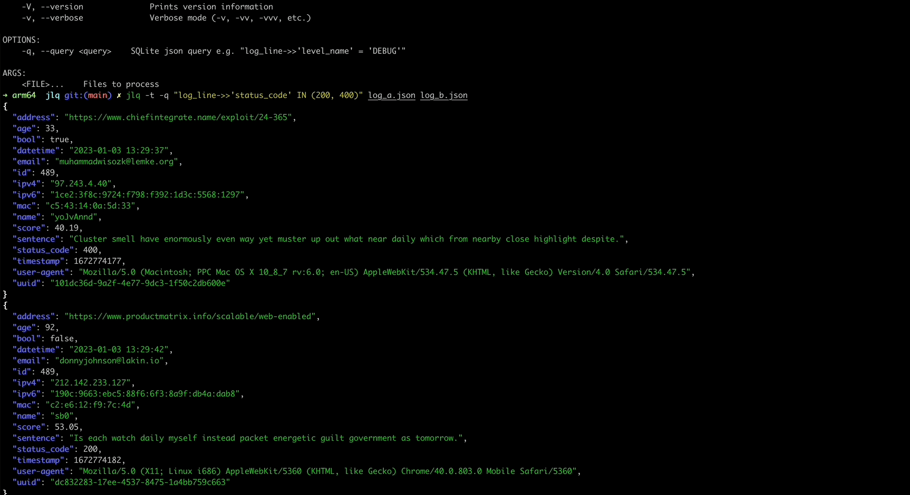

<div align="center">
<h1 align="center">jlq</h1>
<br />
<br>
<br>
Query JSON log files quickly and efficiently with the power of SQLite
</div>

***


## 📜 Core philosophy

- 📦 Stay lightweight
- 🎮 Keep its features as simple as possible
- 🧠 Use SQL to filter JSON log files
- 💡 Use the SQLite's powerful [JSON query functions+operators](https://www.sqlite.org/json1.html)!
- 🛢 Keep queried logs in a nice portable `SQLite` file
- ⚡️ Tail JSON log files based on your query predicates
- 🦾 Run `SQLite` in-memory for faster processing

## ⚠️ Non-goal

This tool doesn't have any plans to cover `jq` or any other query syntax othen than provided out of the box from `SQLite`.

## 🚀 Installation

### Cargo

```sh
cargo install jlq
```

## 🛠️ Usage

It might help to first take a look at the options avaiable via `jql -h`


### Command Line Options
```sh
jlq 0.1.0

USAGE:
    jlq [FLAGS] [OPTIONS] [FILE]...

FLAGS:
    -d, --debug                Activate debug mode
    -h, --help                 Prints help information
    -m, --in-memory-storage    Run SQLite in-memory mode
    -t, --tail
    -V, --version              Prints version information
    -v, --verbose              Verbose mode (-v, -vv, -vvv, etc.)

OPTIONS:
    -q, --query <query>    SQLite json query e.g. "log_line->>'level_name' = 'DEBUG'"

ARGS:
    <FILE>...    Files to process
```

**NOTE**: When running `jlq` with `SQLite` on-disk mode (the default), a `SQLite` file named `jql.db` is created from the directory where the command was run.

### Import log file(s) to SQLite as is with an optional query

```sh
jlq -q "log_line->>'status_code' IN (200, 400)" log_a.json log_b.json
```

### Tail log file(s) with on-disk SQLite file

```sh
jlq -t -q "log_line->>'status_code' IN (200, 400)" log_a.json log_b.json
```

### Tail log file(s) with SQLite running in-memory

```sh
jlq -t -m -q "log_line->>'status_code' IN (200, 400)" log_a.json log_b.json
```


### Contributing

PRs are welcome!

### License
This project is licensed under the MIT license
### Show your support
Leave a ⭐ if you like this project

***
Made with 💖 using `SQLite` 🛢 and `Rust` 🦀